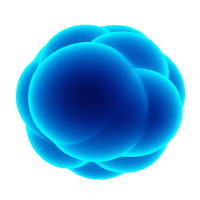
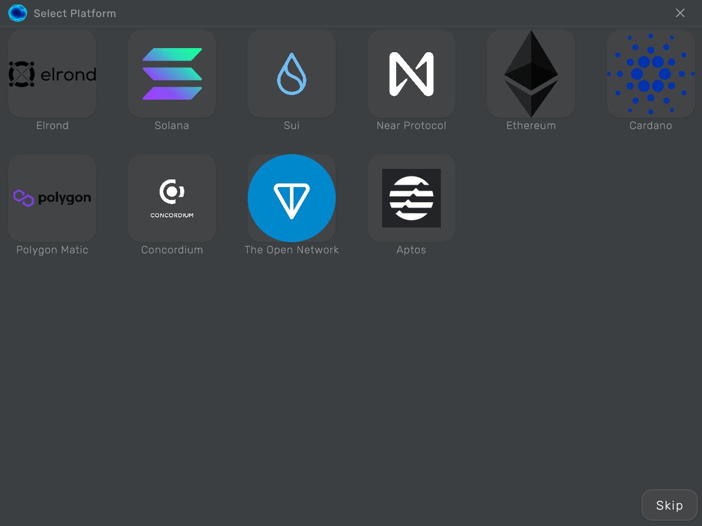

<p align="center">
    
</p>

<h2 align="center">Cohesive</h2>

<p align="center">
  Sleek, intuitive, and powerful Blockchain Integrated Development, and Analysis Environment.
  <br>
<b>Economics</b> | <b>Ergonomics</b> | <b>Aesthetics</b>
</p>



> Convention: We'll use "Platform" and "Blockchain" interchangeably herein - and rarely, "Chain"

Cohesive is a modular meta-tool, i.e., a tool for tools, with a bias towards memory efficiency, performance, and (developer) ease of use. It is Multiplatform, and Blockchain-agnostic with a base implementation of/and, core functionality including but not limited to UI framework, Plugin Store, Simple Editor, and IDE. You'll need it when you need a comprehensive toolset for your Blockchain development needs or use.

## Table of contents
- [Quick start](#quick-start)
- [Status](#status)
- [What's included](#whats-included)
- [Documentation](#documentation)
- [Features](#features)
- [Roadmap](#roadmap)
- [Design Philosophy](#design-philosophy)
- [Contribution](#contribution)

**Note:** This project is in its early stages of development. The project is not yet ready for production use.

## Quick start

### Building a Secondary Plugin for a Specific Platform (Blockchain)

```kotlin
@Cohesive(
    platform = "Ethereum",
    version = "1.0.0",
    nets = [Net(
                k = "mainnet",
                v = "https://mainnet.infura.io/v3/your-api-key"
            ), 
            Net(
                k = "ropsten",
                v = "https://ropsten.infura.io/v3/your-api-key")
           ],
)
class MainView : CohesiveView {
    @Composable
    override fun Explorer() {
        
    }
    @Composable
    override fun Wallet() {
        
    }
}
```

### Running Base desktop application
```
./gradlew :desktop:run
```

### Building Base native desktop distribution
```
./gradlew :desktop:package
# outputs are written to desktop/build/compose/binaries
```
## Status

[](https://github.com/mcxross/cohesive/actions/workflows/code_quality.yml)

## What's included
Above everything, this repo is a Kotlin Multiplatform project containing apps and libraries for the following platforms:

* Web Application
* Desktop Application
* Android Application
* iOS Application (WIP)

## Documentation


## Features
- [x] Multiplatform
- [x] Multi-Blockchain
- [x] Platform Plugin Store (primary, secondary and tertiary)
- [x] Simple Editor
- [x] IDE
- [x] UI Framework(s)

## Roadmap
_Always building, always improving._
## Design Philosophy
Simple, intuitive, and powerful.
 
## Contribution
All contributions to Cohesive are welcome. Before opening a PR, please submit an issue detailing the bug or feature. When opening a PR, please ensure that your contribution builds on the KMM toolchain, has been linted with `ktfmt <GOOGLE (INTERNAL)>`, and contains tests when applicable. For more information, please see the [contribution guidelines](CONTRIBUTING.md).